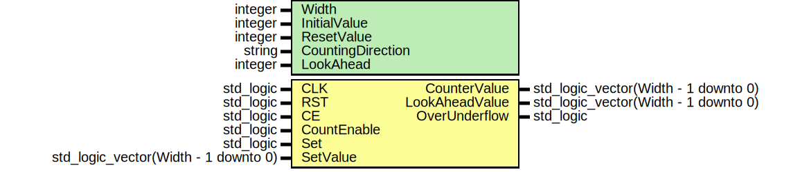
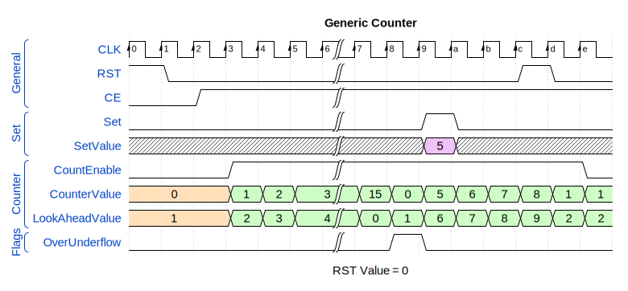

# Entity: GenericCounter

- **File**: [GenericCounter.vhd](src/GenericCounter.vhd)

## Diagram

## Description

- Name: Generic Counter  
- Version: 0.0.2  
- Author: **Maximilian Passarello ([Blog](mpassarello.de))**  
- License: [MIT](LICENSE)  

Generic Counter with the following features:

- **Without Output Register**
- Look ahead value (configurable per generic)
- Synchronous reset
- Clock enable
- Set with priority over the `CountEnable`
- Over- and Underflow flag
- Configurable width
- Configurable initial value
- Configurable reset value
- Configurable counting direction (Up and Down counting)

## History

- 0.0.1 (2024-03-15) Initial version
- 0.0.2 (2024-03-16) Added Testbench. Simulation passed.

## Waveform

## Generics

| Generic name      | Type    | Value | Description                        |
| ----------------- | ------- | ----- | ---------------------------------- |
| Width             | integer | 4     | Width of the counter               |
| InitialValue      | integer | 0     | Initial value of the counter       |
| ResetValue        | integer | 0     | Reset value of the counter         |
| CountingDirection | string  | "UP"  | Counting direction: "UP" or "DOWN" |
| LookAhead         | integer | 0     | Look ahead value                   |

## Ports

| Port name      | Direction | Type                                 | Description                                         |
| -------------- | --------- | ------------------------------------ | --------------------------------------------------- |
| CLK            | in        | std_logic                            | Clock input; rising edge                            |
| RST            | in        | std_logic                            | Reset input; active high; synchronous               |
| CE             | in        | std_logic                            | Clock enable; active high                           |
| CountEnable    | in        | std_logic                            | Count enable; active high                           |
| CounterValue   | out       | std_logic_vector(Width - 1 downto 0) | Counter Value                                       |
| LookAheadValue | out       | std_logic_vector(Width - 1 downto 0) | Look ahead value                                    |
| Set            | in        | std_logic                            | Set with priority over the `CountEnable`            |
| SetValue       | in        | std_logic_vector(Width - 1 downto 0) | If set is high, the counter will be set to SetValue |
| OverUnderflow  | out       | std_logic                            | Over- and Underflow flag                            |
